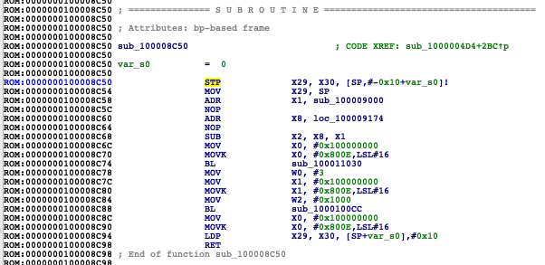
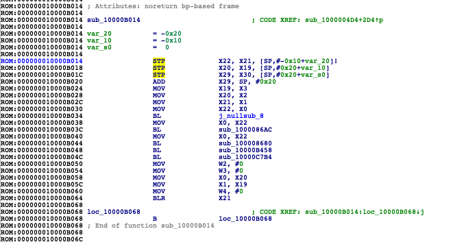

# astris-bootkit
Many people asks me how they can load iBSS and iBEC from DFU after device was demoted. This small documentation was written to explain how to do this and what's the problem. I hoped to make this as clear as possible. Happy reading and if you have any questions feel free to ask me on twitter (@exploit3dguy) =). I do not guarantee that I will answer but I will try to (sometimes I don't see your DMs). The method described here should work on any device meaning A9X and prototypes too.
# The problem
So let's say production devices and components doesn't go in pair with demotion. The low level bootloaders performs checks if device is demoted and if it is device may disable USB (this applies to A9 for example) or device will fail to validate any image4. 
# The requirements
1. A disassembler - I will usa IDA pro
2. JTAG cable (Kanzi,Kong etc.), doesn't really matter which one.
3. It's highly recommended to use iBSS/iBEC for versions lower or equal to iOS 10. On later versions there might be too much checks.
# Developing the BootKit 
I shared the sample code in this repo. See src/boot.s
The code looks like that:

`.text`

`.pool`

`.set prepare_and_jump, 0x10000B014`

`.set JUMP_ADDR, 0x180380000`

`.global _main`

`_main:`

`MOV X0, #0`

`LDR X1, =JUMP_ADDR`

`MOV X2, X0`

`LDR X4, =0x100000790`

`BLR X4`

`LDR X4, =prepare_and_jump`

`BR X4`

Let's first say what those offsets stand for:

1. prepare_and_jump - function in iBoot/LLB/SecureROM which is responsible for booting iBoot/XNU/diags/SecureROM etc.

2. JUMP_ADDR - the address where we put our bootloader

3. 0x100000790 - the function that calls boot trampoline. Boot Trampoline's task is to zero all the registers before jumping to a new image.

Note: all offsets from here are from s8003 (A9 TSMC) SecureROM.

Let's find the offsets now:

1. boot trampoline call function:

search for MOV X18, 0 (120080D2 in hex), go to the begininng of the trampoline. You should see `MSR #6, #0xF` instruction. Then jump to it's XREF and go to beginning of this function.

2. prepare_and_jump

jump to the XREF of `boot trampoline call function`, then look down for nearest BL and jump to it. This will be prepare_and_jump.

3. JUMP_ADDR 

JUMP_ADDR is the address where SecureROM puts the next stage bootloader. It puts it at bootloader's Base Address. To easily find base addr of your bootloader just run it throw kairos, it'll print the Base Address.

After the offsets are found let's compile the shellcode:

`xcrun -sdk iphoneos clang src/boot.s -target arm64-apple-darwin -Wall -o boot.o`

`/usr/local/opt/binutils/bin/gobjcopy -O binary -j .text boot.o boot.bin`

# Booting 

Here is the step by step guide how you can boot image with your freshly built shellcode:

1. Because checkra1n supports all 64-bit checkm8 devices including A9X we can use it to demote our device

`checkra1n -cd`

2. Now we can connect to our device using astris

`astris`

`NO CPU > cpu 0`

`CPU0 > halt`

3. Load our bootloader and execute shellcode

`CPU0 > load LLB/iBSS 0x180380000`

I usually put my shellcode in the place between the free space and re-allocated trampoline address.

`CPU0 > load boot.bin 0x1800DFC00`

`CPU0 > reg pc 0x1800DFC00`

`CPU0 > go`

